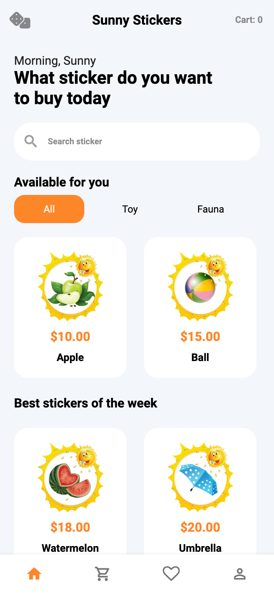
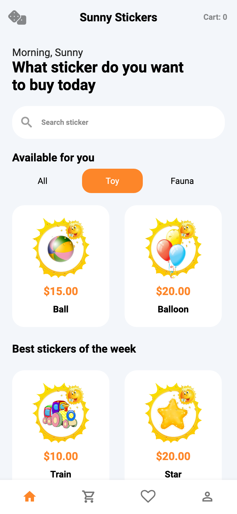
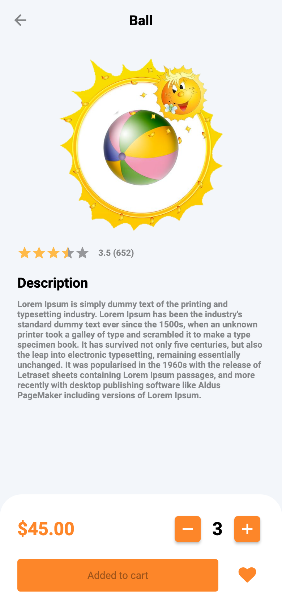
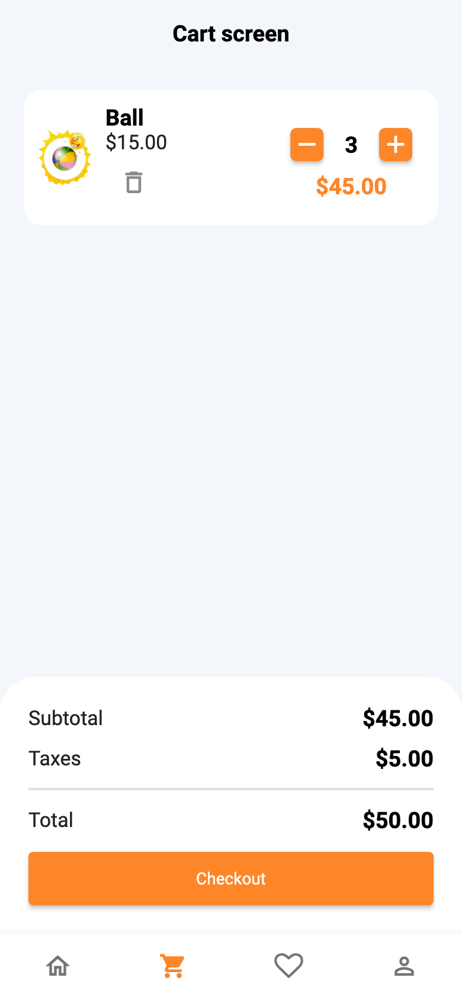
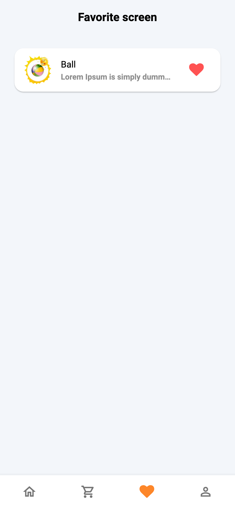
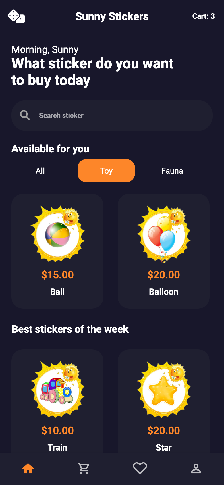
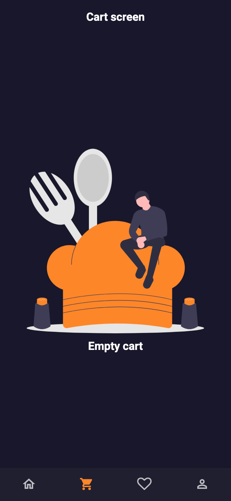
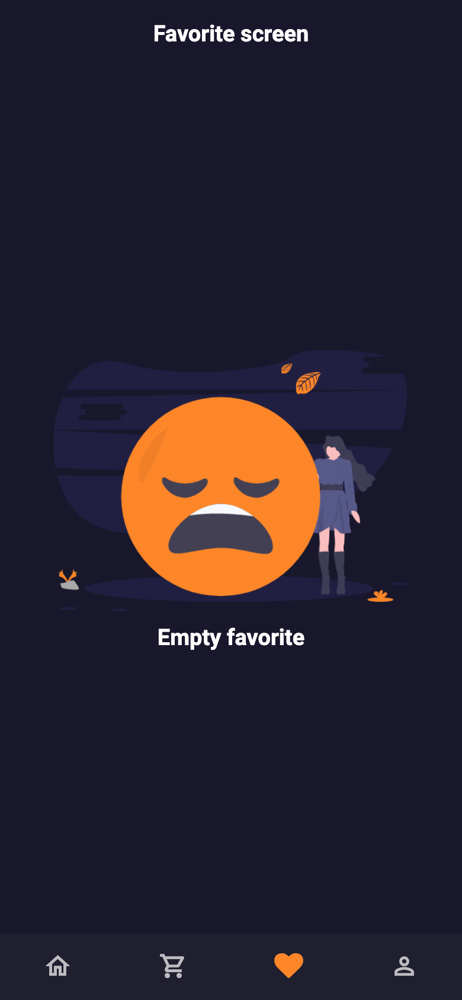

# Отчёт по современным платформам программирования

**Проект:** Sunny Stickers. **Язык:** Dart. **Платформа:** Flutter.

**Репозиторий:** https://github.com/1yuken/sun-stickers

## Выполнение плана

Выполнены все 8 пунктов из README исходного проекта. Для каждого подхода создана отдельная запускаемая версия с одинаковым интерфейсом и полным набором бизнес-действий:

1. Без библиотек: [main.dart](../lib/main.dart), [реализация через setState](../lib/implementations/vanilla/vanilla_app.dart).
2. GetX: [main_getx.dart](../lib/main_getx.dart), [GetxController и реактивный снимок](../lib/implementations/getx/getx_app.dart).
3. BLoC: [main_bloc.dart](../lib/main_bloc.dart), [события, обработчик и BlocBuilder](../lib/implementations/bloc/bloc_app.dart).
4. Cubit: [main_cubit.dart](../lib/main_cubit.dart), [методы, emit и BlocBuilder](../lib/implementations/cubit/cubit_app.dart).
5. MobX: [main_mobx.dart](../lib/main_mobx.dart), [Observable, Action и Observer](../lib/implementations/mobx/mobx_app.dart).
6. Redux: [main_redux.dart](../lib/main_redux.dart), [Store, reducer и StoreConnector](../lib/implementations/redux/redux_app.dart).
7. Provider: [main_provider.dart](../lib/main_provider.dart), [ChangeNotifier и Consumer](../lib/implementations/provider/provider_app.dart).
8. Riverpod: [main_riverpod.dart](../lib/main_riverpod.dart), [NotifierProvider и ref.watch](../lib/implementations/riverpod/riverpod_app.dart).

Бизнес-правила и модели общие, а хранение состояния и реакция интерфейса реализованы средствами соответствующей библиотеки. Сравниваются разные способы управления состоянием одной предметной области, как предусмотрено заданием. Все реализации сохранены в `main`, выбирать вариант можно точкой входа или конфигурацией Run and Debug.

## Все 14 шагов задания

- [x] 1. Подсветка выбранной категории.
- [x] 2. Вывод продуктов по категории.
- [x] 3. Детали выбранного продукта вместо фиксированного Apple.
- [x] 4. Изменение количества в деталях, ограничение снизу: 1.
- [x] 5. Отображение пустой корзины.
- [x] 6. Добавление в корзину без дублирования позиций.
- [x] 7. Список стикеров в корзине.
- [x] 8. Расчёт цены позиции, Subtotal и Total.
- [x] 9. Изменение количества в корзине с немедленным пересчётом.
- [x] 10. Удаление из корзины свайпом и кнопкой.
- [x] 11. Очистка корзины по Checkout и сброс количества.
- [x] 12. Отображение пустого избранного.
- [x] 13. Добавление/удаление избранного и синхронизация экранов.
- [x] 14. Переключение светлой и тёмной темы для всего приложения.

Дополнительно работает поиск по названию, совместимый с фильтром категории, и счётчик товаров. Избранное сохраняется после Checkout. Корзина и избранное обновляются даже при изменении количества на другом экране.

## Демонстрация результата

Снимки сделаны воспроизводимым Flutter-тестом из реальных виджетов и ресурсов приложения, с размером экрана 390 × 844. Демонстрационный сценарий использует вариант без библиотек; те же действия автоматически проверены во всех восьми вариантах.

### Каталог и выбор категории

Каталог содержит 22 стикера. При выборе Toy остаются игрушки и подсвечивается соответствующая категория.

### Детали и корзина

Открыт Ball, увеличено количество до 3 и добавлено в корзину. Цена Ball — $15, поэтому стоимость позиции и Subtotal равны $45; сбор $5, Total — $50.

### Избранное и тема

Ball добавлен в избранное из деталей. Кнопка с кубиком переключает приложение в тёмную тему; выбранная категория сохраняется.

### Пустые состояния после удаления

После Checkout корзина пуста, количество Ball сброшено до 1. Удаление Ball из избранного показывает соответствующий пустой экран.

## Проверка

Проверенная среда: Flutter 3.24.5, Dart 3.5.4. Версии зависимостей зафиксированы.

- Статический анализ: `flutter analyze`.
- Форматирование: `dart format --output=none --set-exit-if-changed lib test`.
- Автоматические тесты: `flutter test --reporter expanded` — 9 проверок модели и 16 сценариев интерфейса (2 × 8 вариантов).
- Release-сборка Web для каждой из восьми точек входа.
- GitHub Actions дополнительно собирает Android APK для всех восьми вариантов; результаты и файлы находятся в [Actions](https://github.com/1yuken/sun-stickers/actions).

Проверены пустые состояния, все категории, переходы к нужному продукту, минимальное количество, сохранение избранного после покупки, отсутствие дубликатов и общих изменяемых данных между запусками. Тесты выполняют нажатия и навигацию, проверяя реальные изменения экрана и состояния.

В учебном задании Checkout означает очистку корзины. Состояние хранится в памяти текущего запуска, как в исходном плане.

## Как показать на паре

1. Запустить выбранный вариант командой из [README](../README.md).
2. Выбрать Toy, открыть Ball, увеличить количество, добавить в корзину и избранное.
3. В корзине изменить количество и показать пересчёт суммы, удалить свайпом и добавить снова.
4. Нажать Checkout, проверить пустую корзину и сохранённое избранное.
5. Удалить из избранного, переключить тему в каталоге и Profile.
6. Повторить с другой точкой входа; в Profile видно название реализации.

## Текст для отправки преподавателю

Ассаляму алейкум, Амет Рифатович! Выполнен полный план проекта Sunny Stickers: без библиотек, GetX, BLoC, Cubit, MobX, Redux, Provider и Riverpod. В каждом варианте реализованы все 14 шагов бизнес-логики: категории, детали, количество, корзина, расчёт стоимости, удаление, Checkout, избранное и переключение темы. Код и инструкции запуска: https://github.com/1yuken/sun-stickers. Отчёт со снимками экранов: https://github.com/1yuken/sun-stickers/blob/main/docs/REPORT.md.
